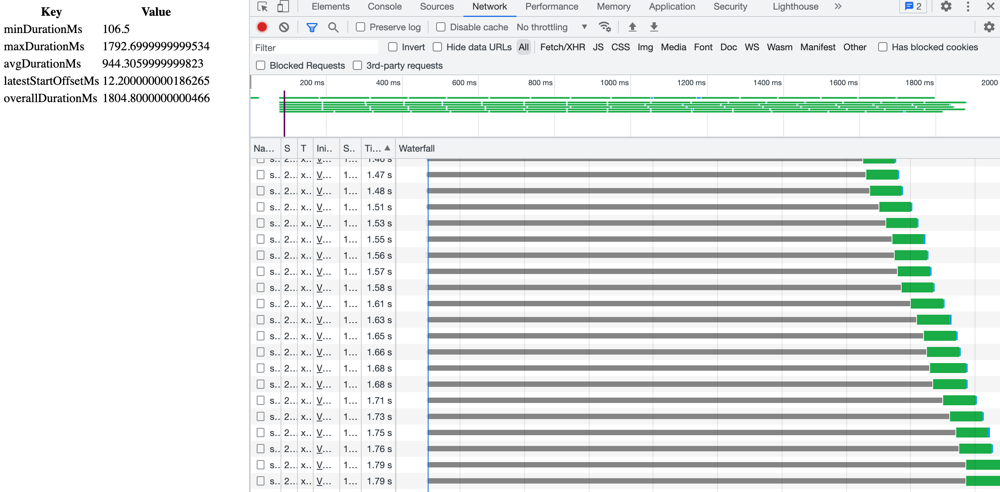
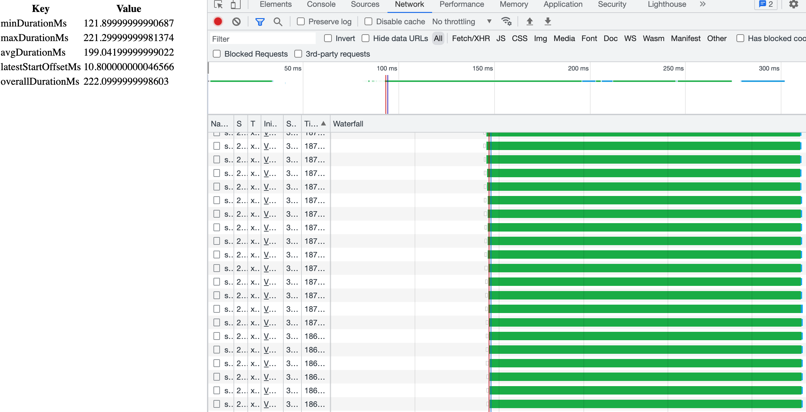

# Request Simultaneity Example
A trivial web app which demonstrates the effect of different HTTP versions when making many near-simultaneous requests.
SSL is mandatory so that the results will better reflect the real world.

## How to run
1. Make sure that the dev SSL certification from the .NET 6 SDK is trusted: https://docs.microsoft.com/en-us/aspnet/core/security/enforcing-ssl?view=aspnetcore-6.0&tabs=visual-studio#all-platforms---certificate-not-trusted 
2. Export your dev certificate to a file named `localhost.pfx` in the root of the solution:
   ```
   dotnet dev-certs https --export-path localhost.pfx -p ""
   ```
3. Build and run the container, specifying the port and HTTP version as follows:
   ```
   docker build . -t rsim
   docker run -d -p 44360:443 -e HTTP_VERSION=1 rsim 
   ```
   The possible values for `HTTP_VERSION` are:
   * 1
   * 2
   * 3

   `1` means "1.1" as Kestrel doesn't support 1.0. Also, in order to use `3` you need to add `--build-arg QUIC=quic` to the `docker build` command line. This will
   include `libmsquic` in the final stage, which currently is only available for the `amd64` architecture.
4. Open `index.html` in a browser and behold the results.

## Typical results
HTTP1.1:


HTTP2:

